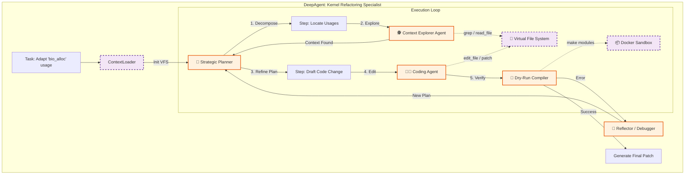

这是针对 **Linux Kernel 复杂逻辑适配场景**（即 Coccinelle 无法处理的场景）的 DeepAgent 深度集成方案。

此方案的核心在于利用 DeepAgent 的 **“规划-探索-执行”** 范式，模拟资深内核开发者的思维过程：先阅读上下文，理解变更原理，制定修改计划，再进行跨文件的精确手术。

-----

# 3\. DeepAgent 集成详细方案：复杂逻辑适配核心 (Code Modification Kernel)

## 3.1 核心定位与适用场景

**DeepAgent (CodeMod Agent)** 是系统中的“特种部队”，仅在以下情况被激活：

  * **语义变更**：函数的生命周期发生变化（例如：资源释放时机改变）。
  * **结构体重构**：某个 `struct` 字段被移除，数据获取方式变为通过辅助函数（Helper Function）间接获取。
  * **并发机制变更**：锁（Locking）机制变化，如 `mutex` 替换为 `spinlock`，或原子操作 API 变更。

## 3.2 内部架构设计 (The Cognitive Loop)

DeepAgent 作为一个独立的 **Super Node** 嵌入在主 LangGraph 中。其内部运行一个基于 **ReAct** 或 **Plan-and-Solve** 的高频循环。



## 3.3 关键组件实现细节

### A. 虚拟文件系统 (VFS) 与上下文管理

内核源文件巨大（如 `fs/super.c` 可能有上万行）。DeepAgent 不能将整个文件读入 Context Window。

  * **机制**：DeepAgent 维护一个虚拟的文件索引。
  * **MCP 工具**：
      * `ls_tree`: 查看目录结构。
      * `grep_source`: 类似 grep，快速定位受影响代码行。
      * `read_window`: **关键工具**。读取指定函数周围 +/- 20 行的代码，而非全文件。
      * `symbol_lookup`: 基于 ctags/LSP 查找定义。

### B. Planner (规划器) 的内核适配

Planner 不会直接写代码，而是先生成 `MIGRATION_PLAN.md`。

**Prompt 示例:**

> "你是 Linux Kernel 迁移专家。目标是将 `driver/net/ethernet/intel/e1000` 模块从 5.10 迁移到 6.6。
> 已知 RAG 分析结果：`netif_napi_add` 函数签名减少了一个参数。
> **不要急于修改。**
>
> 1.  先使用 `grep` 找到所有调用点。
> 2.  阅读调用点周围的上下文，确认 `weight` 参数是如何传递的。
> 3.  制定修改计划：直接删除参数，还是需要调整逻辑？
> 4.  将计划写入 `plan.md`，然后逐个文件执行修改。"

### C. 子 Agent 委派 (Sub-agent Delegation)

为了防止上下文污染，主 DeepAgent 可以孵化子 Agent：

  * **Explorer Agent**: 专门负责“读”。只负责在海量代码中定位信息，输出简短摘要。
  * **Coder Agent**: 专门负责“写”。接收 Explorer 的摘要，生成具体的 `sed` 命令或 Patch。

## 3.4 代码实现框架 (Python)

以下代码展示了如何利用 `deepagents` 库构建这个特定的内核修改 Agent。

```python
from typing import List, Optional
from deepagents import create_deep_agent
from deepagents.tools import FileSystemTools, ShellTools
from langchain_core.tools import tool
from langchain_openai import ChatOpenAI
from pydantic import BaseModel, Field

# 1. 定义内核专用工具 (MCP Tools)

class KernelSearchInput(BaseModel):
    pattern: str = Field(description="Regex pattern to search in source code")
    path: str = Field(description="Directory or file path to limit search")

@tool("kernel_grep", args_schema=KernelSearchInput)
def kernel_grep_tool(pattern: str, path: str):
    """
    专门用于内核源码的搜索工具。返回匹配行及其行号。
    等价于: grep -rn "pattern" path
    """
    # 实际实现会调用 Docker 内的 grep 命令
    return docker_exec(f"grep -rn '{pattern}' {path} | head -n 20")

class SymbolLookupInput(BaseModel):
    symbol: str = Field(description="Function or struct name")

@tool("lookup_symbol_def")
def lookup_symbol_tool(symbol: str):
    """
    查找内核符号定义。使用 ctags 或 grep 查找定义位置。
    """
    return docker_exec(f"global -x {symbol}") # 假设安装了 GNU Global

# 2. 初始化 DeepAgent

def build_kernel_mod_agent(task_id: str, source_dir: str):
    """
    构建具备内核修改能力的 Deep Agent
    """
    llm = ChatOpenAI(model="gpt-4o", temperature=0.1) # 低温以保证代码准确性
    
    # 挂载工具集
    # FileSystemTools 提供了 read_file, write_file, list_dir 等基础能力
    tools = [
        *FileSystemTools(root_dir=source_dir).get_tools(), # 限制在沙箱目录
        kernel_grep_tool,
        lookup_symbol_tool
    ]

    # 系统提示词 (System Prompt) 注入
    system_prompt = """
    You are a Senior Linux Kernel Maintainer.
    Your goal is to adapt a kernel module to a newer kernel version.
    
    CRITICAL RULES:
    1. **Plan First**: Always use `write_file` to create a `plan.md` before editing code.
    2. **Context First**: Do not guess API signatures. Use `lookup_symbol_def` or `read_file` to verify the NEW kernel headers (in /usr/src/linux-headers-6.6/).
    3. **Minimal Change**: Make the smallest possible change to make it compile.
    4. **Coding Style**: Adhere strictly to Linux Kernel Coding Style (e.g., specific indentation).
    """

    # 创建 Agent
    # enable_planning=True 开启内置的规划循环
    agent = create_deep_agent(
        model=llm,
        tools=tools,
        system_prompt=system_prompt,
        backend="filesystem", # 启用虚拟文件系统记忆
        root_dir=source_dir
    )
    
    return agent

# 3. 集成到 LangGraph Node

def code_mod_node(state):
    """
    LangGraph 中的执行节点
    """
    task_id = state["task_id"]
    sandbox_path = f"/tmp/sandbox/{task_id}"
    
    # 获取 RAG 分析结果
    analysis = state["change_analysis"]
    target_api = state["target_api"]
    
    instruction = f"""
    Task: Adapt usage of '{target_api}' in the module located at {sandbox_path}.
    
    Analysis from RAG:
    {analysis['description']}
    {analysis['migration_guide']}
    
    Execute the plan and produce a unified diff patch.
    """
    
    agent = build_kernel_mod_agent(task_id, sandbox_path)
    
    # 执行 DeepAgent
    result = agent.invoke({"messages": [("user", instruction)]})
    
    return {
        "raw_patch": result["output"], # 假设 Agent 最后输出了 Diff
        "review_comments": ["Generated by DeepAgent"]
    }
```

## 3.5 交互流程示例

当用户需要迁移 `alloc_disk(int minors)` (5.10) 到 `blk_mq_alloc_disk` (6.6，移除了 `minors` 参数并改变了错误处理) 时：

1.  **LangGraph** 识别出这是一个复杂变更（因为涉及错误处理逻辑变化），路由给 **DeepAgent**。
2.  **DeepAgent (Planner)**:
      * *Thought*: 我需要先看 6.6 的 `blk_mq_alloc_disk` 原型，再看当前代码怎么用 `alloc_disk` 的。
      * *Action*: `write_file("plan.md", "- [ ] Check 6.6 header\n- [ ] Grep alloc_disk usages...")`
3.  **DeepAgent (Explorer)**:
      * *Action*: `grep_source("alloc_disk", "drivers/my_driver")` -\> 发现 3 处调用。
      * *Action*: `read_file("drivers/my_driver/main.c", lines=100-150)` -\> 读取上下文。
4.  **DeepAgent (Coder)**:
      * *Thought*: 旧代码检查了 `alloc_disk` 返回 NULL，新代码 `blk_mq_alloc_disk` 返回 `ERR_PTR`。我需要修改错误检查逻辑 `if (!disk)` 为 `if (IS_ERR(disk))`。
      * *Action*: `edit_file(...)` 应用修改。
5.  **DeepAgent (Verifier)**:
      * *Action*: `shell("make modules")` -\> 编译通过。
6.  **Output**: 生成最终 Patch。

## 3.6 安全与限制策略

为了防止 DeepAgent "暴走"（例如删库或死循环）：

1.  **Docker 隔离**：`root_dir` 必须映射到 Docker 容器内，严禁挂载宿主机 `/usr/src` 为可写。
2.  **只读内核源码**：目标内核（6.6）的源码目录对 Agent 必须是 **Read-Only** 的，防止 Agent 错误修改了内核头文件而不是驱动代码。
3.  **Step 限制**：在 `create_deep_agent` 中设置 `max_iterations=50`，防止陷入无限思考循环。